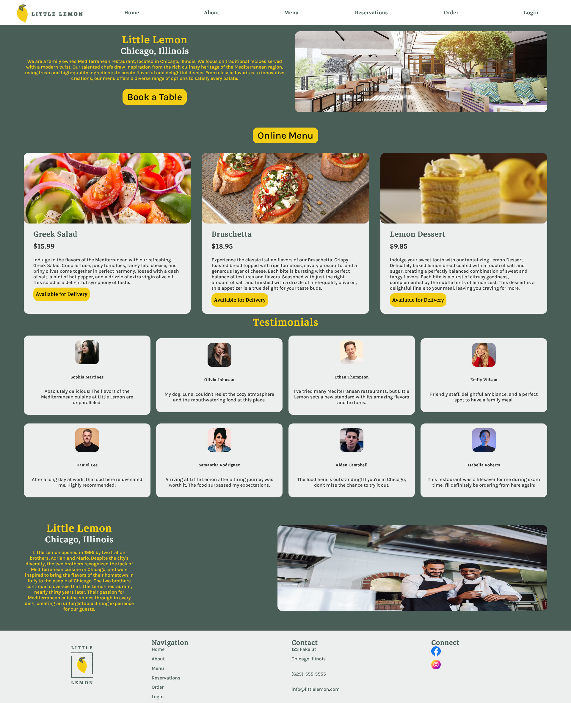
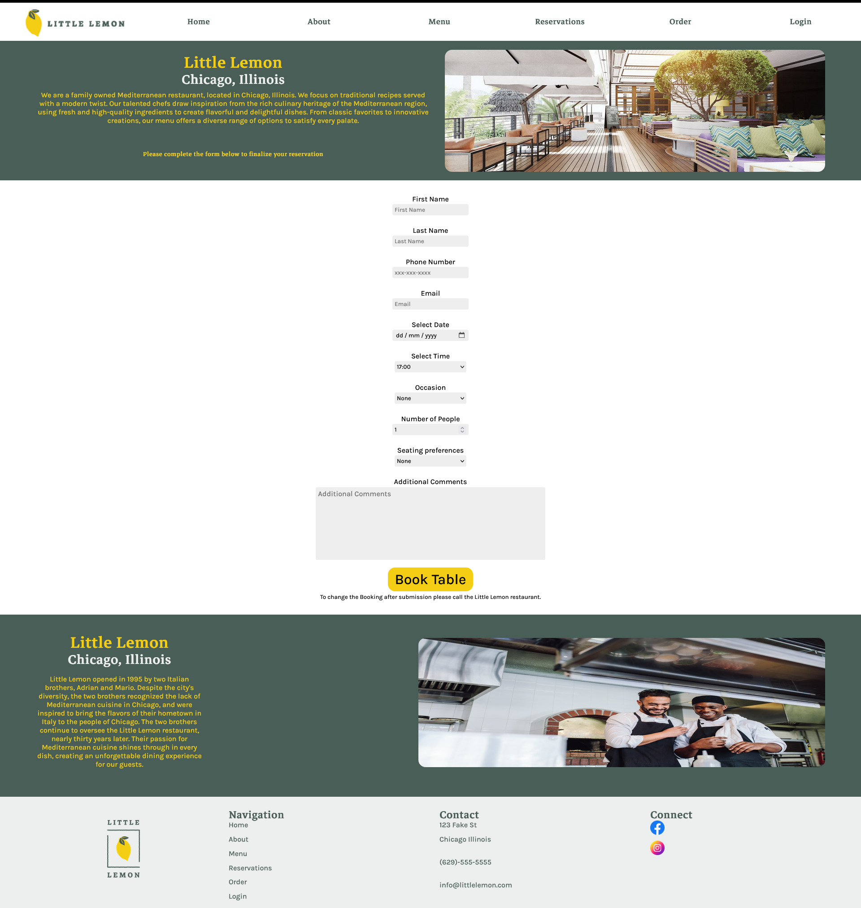

# Little Lemon Restaurant - Jayden Fisher

This is the capstone project for Meta Front-end developer program on Coursera, which contains a detailed and responsive website with table-booking functionality built using React.
Built by Jayden Fisher

## Screenshot

### Home Page

### Booking Page

### Third Party Libraries & APIs:

- react-router-dom
- react-responsive-carousel
- Meta front-end table-booking API

### Install and Run:
- Run 'npm install'
- Run 'npm start'

### Author

- [Jayden Fisher](https://github.com/JaydenF56)
